# Typing Test

> **Note**
>
> New repository that is maintained can be found [here](https://github.com/austin-jrh/typingtest).
> 
> This is repo is kept as a endpoint for my SUTD course.

### Link to frontend repository: https://github.com/austin-jrh/sutd-devtools2022

---

### Table of Contents 
- [Features](#features)
- [Technical Stack](#technical-stack)
  - [Front-end](#front-end)
  - [Back-end](#back-end)
  - [Deployment](#deployment)
- [Demo](#demo)
- [Setup](#setup)
- [Security Vulnerability](#security-vulnerability)

## Features

Typing Test is a simple typing test app where you can measure your typing speed.

Features are:
- User Profile
  - Register, Login, Edit Display Name, Persistent User using `localStorage`.
- Typing Test
  - Generate Random words, Custom user defined words, (scuffed) WPM calculation, saving of high score to logged in user.
  
Words per minute is calculated with the following formula:


Taken from: https://www.typingtyping.com/wpm-calculator/

_Note_: The formula is loosely followed because shortcuts are done due to technical limitations. Therefore, the WPM calculation is not very accurate.

## Technical Stack
### Front-end

[Link to repository](https://github.com/austin-jrh/sutd-devtools2022)

Using:
- Vue.js (MVVM framework)
- Element+ (UI framework)
- random-words (NPM library)
- Google Fonts (Roboto Mono and Inconsolata)

### Back-end
Using:
- Node.js (runtime environment)
- Express (web application framework)
- Sqlite (database)

### Deployment
Using:
- Docker (Container)
- NGINX (Reverse proxy)
- Amazon EC2 (Cloud)

## Demo
- Get all custom tests

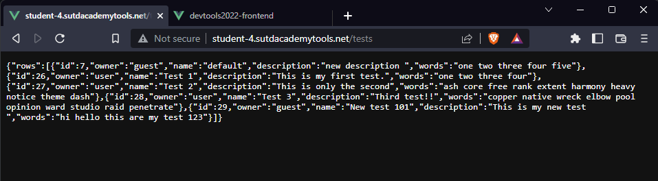


- Get all profiles

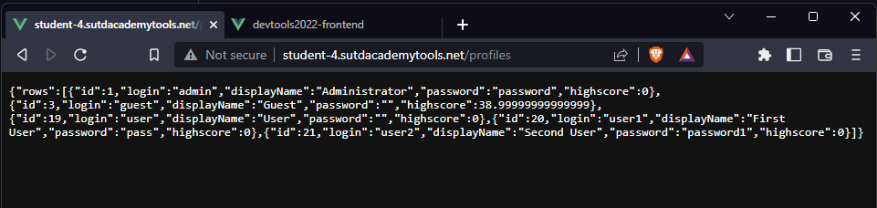


- Get `user` profile

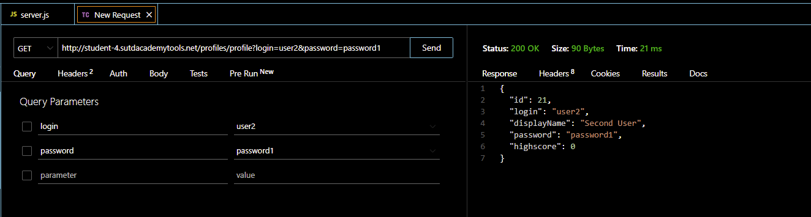


- Create `user` profile

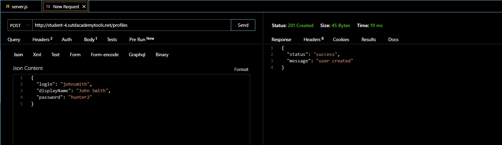


- Edit `user` profile

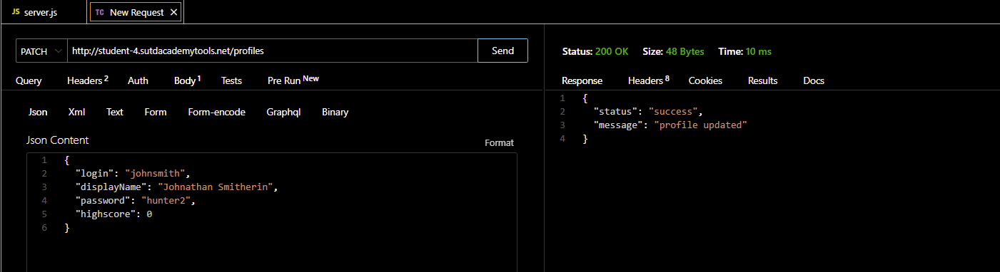


- Delete `test`

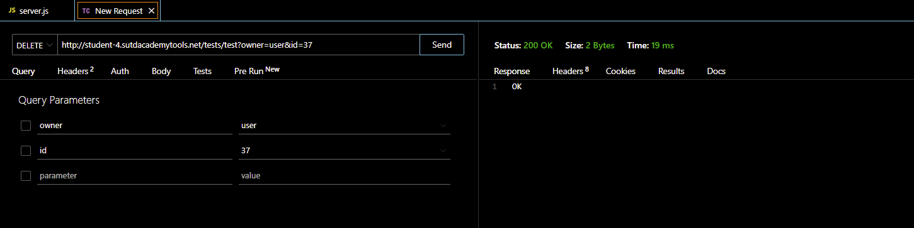

Full list:

Operation | Profiles | Tests 
--- | --- | ---
GET all | http://student-4.sutdacademytools.net/profiles | http://student-4.sutdacademytools.net/tests
GET one | http://student-4.sutdacademytools.net/profiles/profile?login=$login&password=$password | http://student-4.sutdacademytools.net:3001/testID/?id=$id
POST (create) | http://student-4.sutdacademytools.net/profiles/profiles <br />body:<br />{<br />&ensp;"login": $login,<br />&nbsp;"displayName":$displayName,<br />&nbsp;"password":$password<br />} | http://student-4.sutdacademytools.net/tests <br />body:<br />{<br />&ensp;"owner": $login,<br />&nbsp;"name":$name,<br />&nbsp;"description":$description,<br />&nbsp;"words":$words<br />}
PATCH (update) | http://student-4.sutdacademytools.net/profiles/profiles <br />body:<br />{<br />&nbsp;"displayName": $name,<br />&nbsp;"highscore":$highscore,<br />&nbsp;"login":$login,<br />&nbsp;"password":$password<br />} | http://student-4.sutdacademytools.net/tests <br />body:<br />{<br />&nbsp;"owner": $login,<br />&nbsp;"name":$name,<br />&nbsp;"description":$description,<br />&nbsp;"words":$words,<br />&nbsp;"owner":$login,<br />&nbsp;"id":$id<br />}
DELETE | N.A. | http://student-4.sutdacademytools.net/tests/test?owner=$owner&id=$id

## Setup
1. Clone the repository. 
```
git clone https://github.com/austin-jrh/sutd-devtools2022-backend.git
```

2. Install Docker.
```
# Install Docker packages
sudo apt-get update
sudo apt-get install \
    ca-certificates \
    curl \
    gnupg \
    lsb-release
    
# Add docker official gpg key
sudo mkdir -p /etc/apt/keyrings
curl -fsSL https://download.docker.com/linux/ubuntu/gpg | sudo gpg --dearmor -o /etc/apt/keyrings/docker.gpg

# Setup docker repo
echo \
  "deb [arch=$(dpkg --print-architecture) signed-by=/etc/apt/keyrings/docker.gpg] https://download.docker.com/linux/ubuntu \
  $(lsb_release -cs) stable" | sudo tee /etc/apt/sources.list.d/docker.list > /dev/null

# Install docker engine
sudo apt-get update
sudo apt-get install docker-ce docker-ce-cli containerd.io docker-compose-plugin
 
# Start the service
sudo service docker start

# Run docker without sudo,
sudo groupadd docker
sudo usermod -aG docker $USER
newgrp docker 
docker ps 
```

3. Navigate to path where the `Dockerfile` exist.
```
ls # you should be in the Dockerfile directory
```

4. Run `run.sh` to build and run Dockerfile.
```
./run.sh
```

5. Verify if the Docker container is running.
```
docker ps
```

6. Install NGINX
```
sudo apt-get update
sudo apt-get install nginx
```

7. Configure NGINX
```
sudo nano /etc/nginx/sites-available/default
```

8. Add the following code to `default` file
```
server {
  listen 80;
  server_name student-4.sutdacademytools.net;
  location / {
    proxy_pass http://localhost:8080;
    proxy_set_header X-Real-IP $remote_addr;
    proxy_set_header X-Forwarded-For $proxy_add_x_forwarded_for;
    proxy_set_header Host $host;

  }

  location /profiles {
    proxy_pass http://localhost:3001;
    proxy_set_header X-Real-IP $remote_addr;
    proxy_set_header X-Forwarded-For $proxy_add_x_forwarded_for;
    proxy_set_header Host $host;

  }

  location /tests {
    proxy_pass http://localhost:3001;
    proxy_set_header X-Real-IP $remote_addr;
    proxy_set_header X-Forwarded-For $proxy_add_x_forwarded_for;
    proxy_set_header Host $host;

  }
}
```

9. Start NGINX
```
sudo service nginx start
```

## Security Vulnerability
### SQL Injection attack with crafted form inputs (login)
To log in to an existing user, the app will do a query to the database if an entry with `login` and `password` exists in the database. 

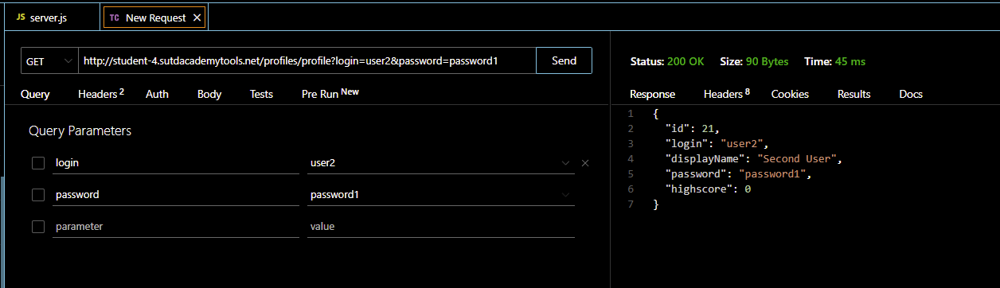

If the account does exist, the user is "logged in" to the account and have free reign. If the user provides the wrong login/password, the app will return an empty body with a status of `204`. 

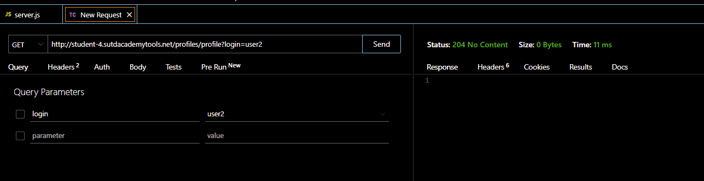

The query used for verification are as follows: 
```sql
SELECT * FROM profiles WHERE login = '${req.query.login}' AND password = '${req.query.password}'
```
In order for an attacker to by-pass this check, the attacker can do a query where the `login` is filled and the rest of the string will be commented.

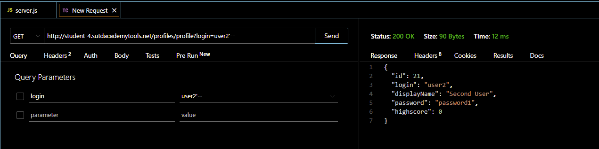

In order to mitigate this, the app can use `preparedStatements`, or libraries such as `axios` or `knex`, which separates the statement and query values, which also are stored in variables.

### Modifying the database without authorization (change highscore)
In the app, the user is allowed to change the account's display name, which uses the following query:
```sql
UPDATE profiles SET displayName = '${reqBody.displayName}', highscore = ${reqBody.highscore} WHERE login = '${reqBody.login}' AND password = '${reqBody.password}'
```
The attacker will be able to by-pass the `login` and `password` check by adding comments to the body of the request.
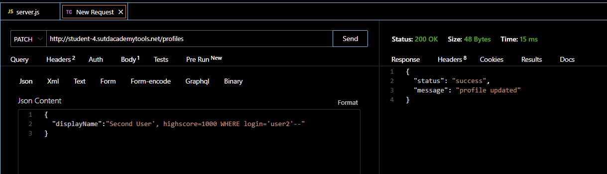
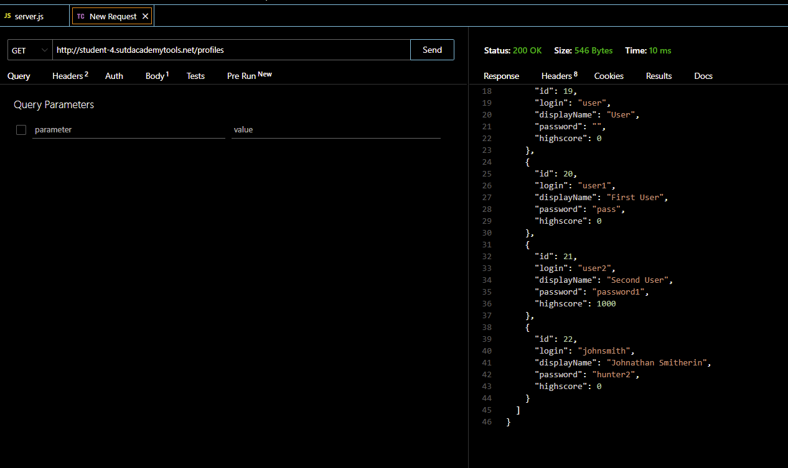

In addition to the mitigation of the first vulnerability, the entries can be validated, removing vulnerable characters such as `--` or `#` that comments out code.

### Access to profiles
Anyone can access the credentials stored in the database by accessing the URL. 


To mitigate this, the app can have a proper authentication and encryption so that accounts cannot be easily compromised.
